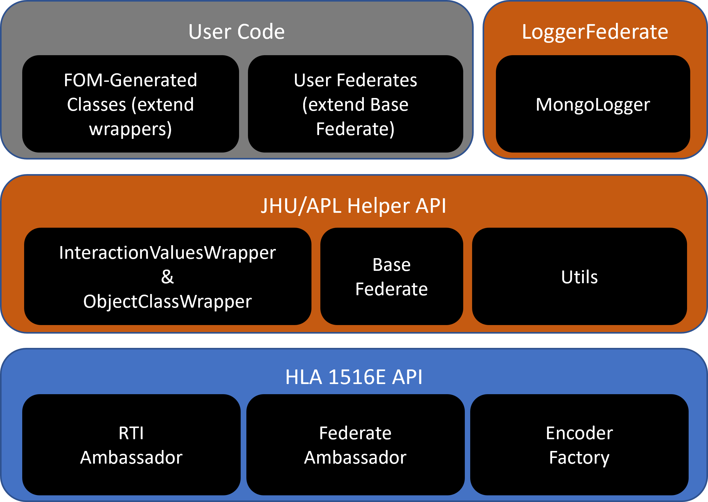
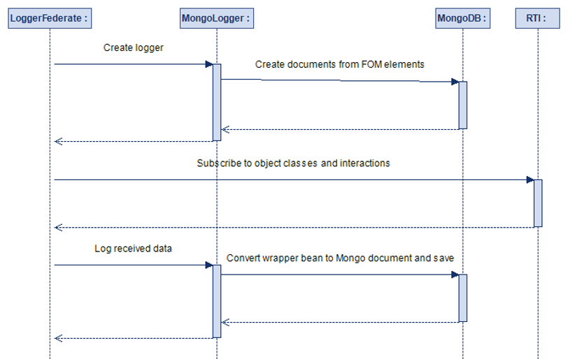

© 2024  The Johns Hopkins University Applied Physics Laboratory LLC.

The HLA Helper is a software library written in Java to help facilitate the rapid development of federated simulations using the IEEE 1516-2010 High Level Architecture, also known as HLA-Evolved.

The library provides the following functionality:

1. A utility class with static encoder and decoder methods for all primitive types.
   1.1. Each method handles all of the HLA code necessary to generate the native encoder or decoder, perform the required operations, and return either a byte array ready to transmit or a Java primitive for use in the federate code.
   1.2. While these static methods can be called directly, there are also universal encode and decode methods, which infer the correct primitive type methods to call based on either metadata in the HLA API callback method or type information derived from the native Java object type.

2. A pair of abstract super classes, one for object classes and another for interactions, capable of parsing a message received from the RTI or encoding a message for transmission.
   2.1. The abstract classes utilize information pulled from the RTI ambassador class (a component provided by the HLA specification used to interact with the federation and query for object model metadata) and Java introspection to determine what fields on their implementing subclasses map to corresponding elements of the FOM.

3. A utility class which generates of all the required code to automatically convert the HLA object model, as defined in the Federation Object Model (FOM) file required by HLA-Evolved, into Java classes extending the abstract super classes for both HLA interactions and object classes, as well as custom HLA enumerations.

4. A pair of change tracking aspects, utilizing the AspectJ framework, woven into all of the concrete subclasses described in part three at compile time, which allow for the HLA RTI encoding of only those object variables that have been explicitly locally modified.

5. An abstract HLA federate superclass with convenience methods that eliminate the complexity and boilerplate code to manage:
   5.1. Simulation management
   5.2. Publication and subscription
   5.3. Time management and synchronization points

6. A logger federate which is capable of automatically subscribing to all simulation object classes and interactions, or a specified subset, and logging all simulation events to a database. The logger creates the required schema at runtime based on the elements of the object model subscribed to. 

7. The code generation framework simplifies the development of new simulation federates by encapsulating the repetitive details of some HLA APIs, which both reduces development and debugging time and increases the pool of developers who can come up to speed quickly on integrating models as simulation federates.
